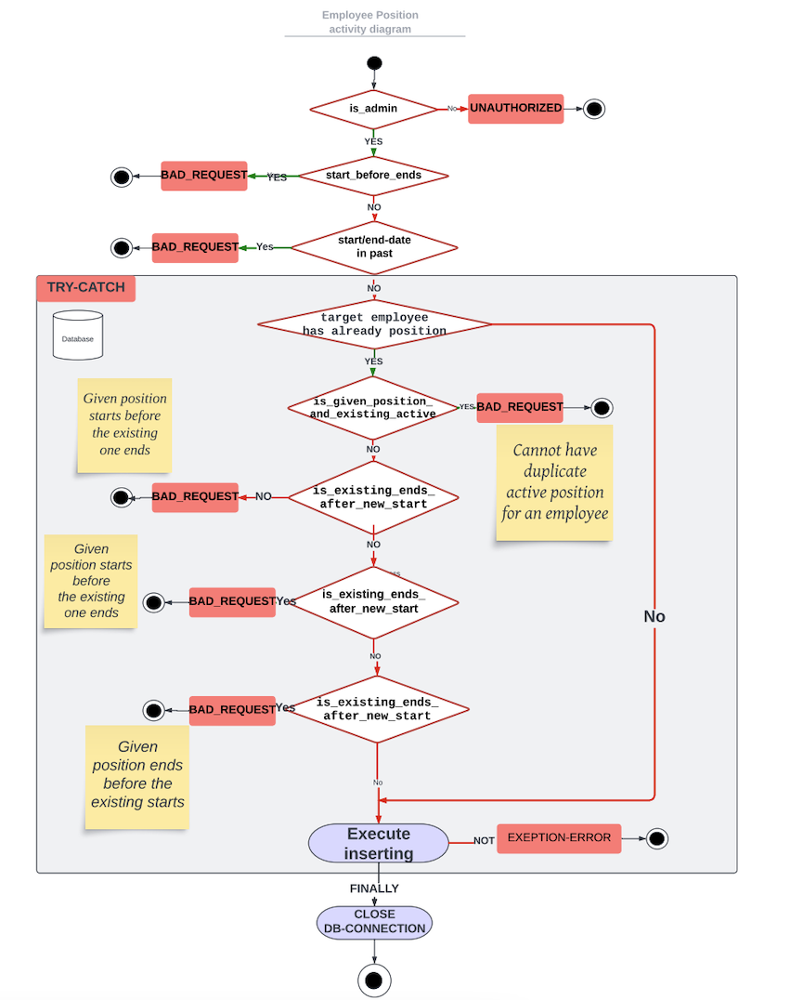

# task_tracking
Task tracking system for managing employee positions and assignments.

## Project Overview

- `api/`: Contains the API code and endpoints for handling request for Employee, Position, Task and their third tables (employee_position, employee_task)

- `model/`: Contains the data model classes.

- `dao/`: Contains files for Each table to handle sql query for each of schema table

- `images/`: Contains screenshots of diagram's used in documentation as ERD

- `model/`: Contains the data model classes.

- `tests/`: Contains unit tests file for each of classes located in _**dao/**_ and _**utilities/**_ .

- `utilities/`: Contains several files that has help functions e.g:.
  - DateValidator: used to check overlapping between two positions and assigning tasks
  - JsonWithDateEncoder: used to encode all json files to fix Json not serializable and/or encode to specific model class
  - UuidGenerator: It generates uuid and concat it with text param, used to generate id's for database

- `main.py`: The main root of the application hosts all endpoints using Flask.

## Database

The most important thing to emphasize in the database model 
is that the relationship between employee and position is many-to-many. 
Therefore, I have a third table called 'employee_position'. 
The reason for this is that an employee can have multiple non-overlapping positions. Additionally, a position can belong to multiple employees at the same time.

For the relationship between Task and Employee, I chose to connect them again through a third table. 
This is because it is natural for an employee to have multiple tasks at the same time. Additionally, I wanted to make it possible that a task can be assignable to none or many employees.

## Diagram's and flow charts

The diagram above shows how I handle creating relation between Employee(s) and Position(s)

To handle all possible cases (that came to my mind), I end up with avoiding following:

1. Since I've admin role. I send UNAUTHORIZED response if the creator/responsible_id not has admin role
2. Then I check two cases related to date, but not to existing relation.
   3. If start-date for given position bigger than end-date. "start in feature, and go backward"
   4. If start/end-date for given position smaller than now date. "start position or end it in past"
      5. Here would be discussed to make it possible to start in the past, in case someone forgot to start relation in time,
      6. Additionally, I make update function which is possible to start in past for this
3. Now I check if the Employee already has position, if yes
   4. If both given and existing position has active parameter TRUE, I send ALREADY_EXISTING.
   5. If existing end-date bigger than or equal given start-date. "start new position before ending the existing" --> BAD_REQUEST
   6. If existing end-date bigger than or equal given end-date. "end new position before ending the existing" --> BAD_REQUEST
   7. If existing start-date bigger than or equal given end-date. "end new position before starting the existing one" --> BAD_REQUEST
   8. Last two points are very edge case's, but I included anyway
4. If the code came so far then I try to insert the data, catch Exception without specifying to catch and log all of them
5. Finally, I close database connection