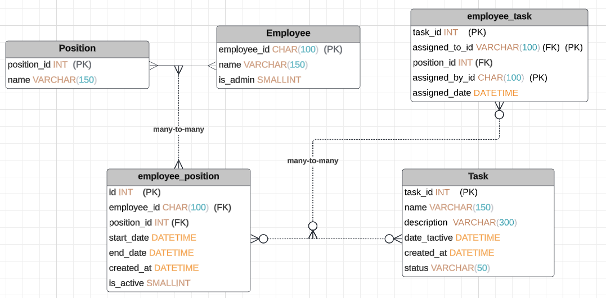

# task_tracking
Task tracking system for managing employee positions and assignments.

## Database

The most important thing to emphasize in the database model 
is that the relationship between employee and position is many-to-many. 
Therefore, I have a third table called 'employee_position'. 
The reason for this is that an employee can have multiple non-overlapping positions. Additionally, a position can belong to multiple employees at the same time.

For the relationship between Task and Employee, I chose to connect them again through a third table. 
This is because it is natural for an employee to have multiple tasks at the same time. Additionally, I wanted to make it possible that a task can be assignable to none or many employees.

## Project Overview

- `api/`: Contains the API code and endpoints for handling request for Employee, Position, Task and their third tables (employee_position, employee_task)

- `model/`: Contains the data model classes.

- `dao/`: Contains files for Each table to handle sql query for each of schema table

- `images/`: Contains screenshots of diagram's used in documentation as ERD

- `model/`: Contains the data model classes.

- `tests/`: Contains unit tests file for each of classes located in _**dao/**_ and _**utilities/**_ .

- `utilities/`: Contains several files that has help functions e.g:.
  - DateValidator: used to check overlapping between two positions and assigning tasks
  - JsonWithDateEncoder: used to encode all json files to fix Json not serializable and/or encode to specific model class
  - UuidGenerator: It generates uuid and concat it with text param, used to generate id's for database

- `main.py`: The main root of the application hosts all endpoints using Flask.